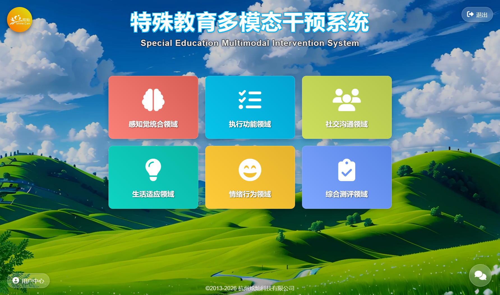
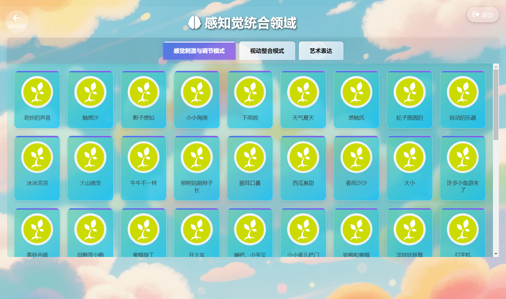
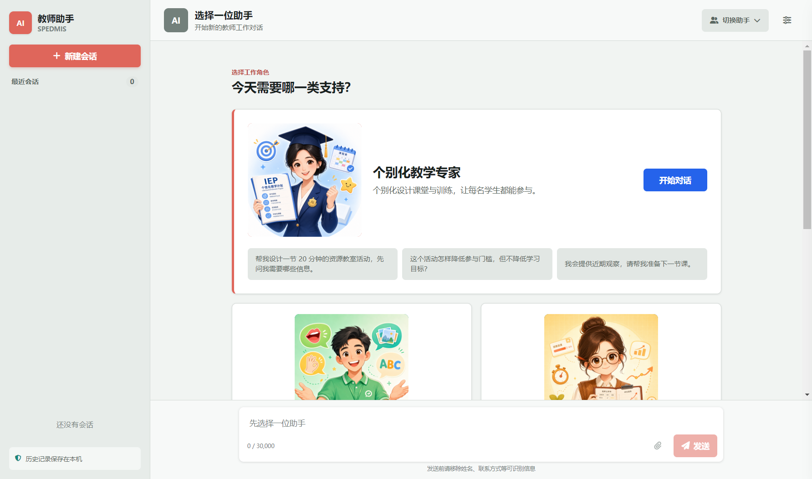
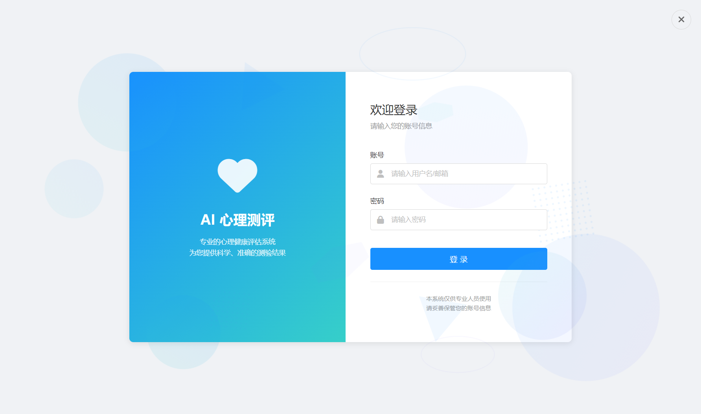
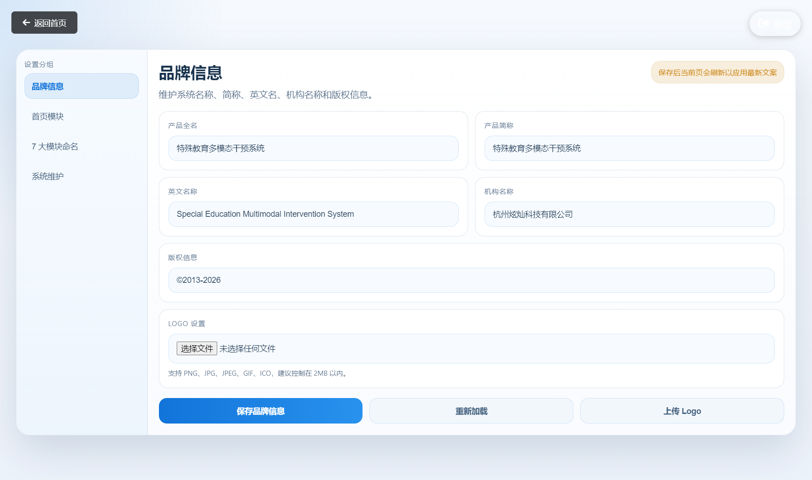
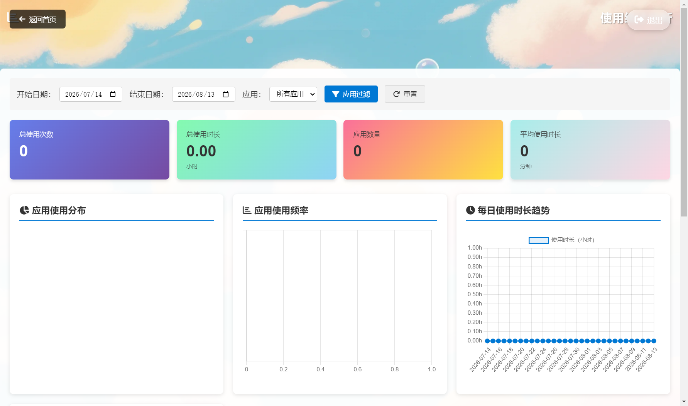
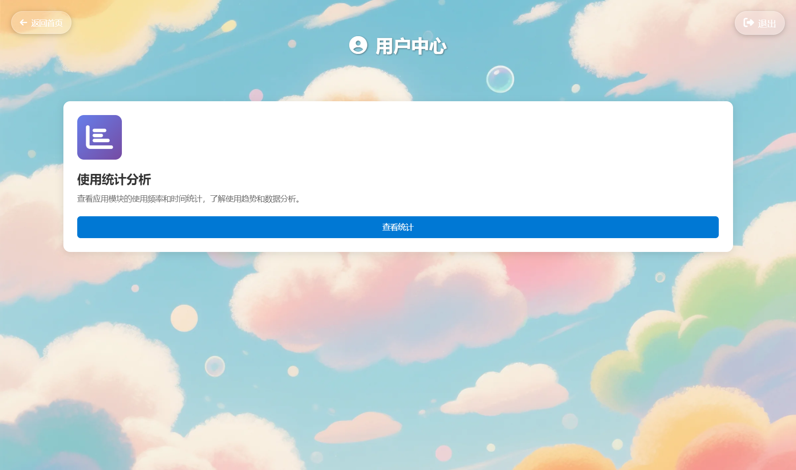

# 特殊教育多模态干预系统 — 用户操作手册

**文档版本**：v1.1.0
**更新日期**：2026-08-13
**适用版本**：SPEDMIS v1.2.2
**面向用户**：特殊教育教师、康复治疗师、学校管理人员
**维护单位**：杭州炫灿科技有限公司

---

## 目录

- [1. 产品简介](#1-产品简介)
- [2. 主界面](#2-主界面)
- [3. 模块导航与干预应用](#3-模块导航与干预应用)
- [4. 综合测评领域（IEP）](#4-综合测评领域iep)
- [5. AI 教师工作台](#5-ai-教师工作台)
- [6. AI 心理测评](#6-ai-心理测评)
- [7. 高级设置（管理员）](#7-高级设置管理员)
- [8. 使用统计](#8-使用统计)
- [9. 用户中心](#9-用户中心)
- [10. 常见问题](#10-常见问题)

---

## 1. 产品简介

特殊教育多模态干预系统（SPEDMIS）是面向特殊教育场景的桌面应用，用于集中展示、分类和启动特殊教育多模态干预工具，并提供 AI 教师工作台、AI 心理测评等辅助能力。

系统主要包含以下部分：

| 功能 | 说明 |
|------|------|
| 干预工具导航 | 按 6 大领域分类展示干预应用，一键启动 |
| AI 教师工作台 | 5 个教师工作场景智能体，支持对话、知识问答与只读数据查询 |
| AI 心理测评 | 独立登录与测评看板 |
| 系统管理 | 高级设置、使用统计、用户中心、Logo 管理 |

> 本文档面向**已完成安装与激活**的用户，介绍日常操作。

---

## 2. 主界面

双击桌面快捷方式启动系统后进入主界面：

**界面说明**：

1. **顶部标题区**：显示系统名称与英文名称，右上角为「用户中心」与「退出」按钮。
2. **领域卡片区**：6 大干预领域卡片，颜色各异、图标区分，点击进入对应模块：
   - 感知觉统合领域
   - 执行功能领域
   - 社交沟通领域
   - 生活适应领域
   - 情绪行为领域
   - 系统数据管理
3. **可选模块**：根据学校配置，可能显示「AI 心理测评」卡片（入口模块可在高级设置中切换）。
4. **右下角浮动按钮**：**AI 助手**（打开 AI 教师工作台）。

> 卡片名称可在「高级设置 → 模块命名」中自定义为学校习惯的名称。

---

## 3. 模块导航与干预应用

以「感知觉统合领域」为例，点击主界面卡片进入模块页：

**操作流程**：

1. 在主界面点击领域卡片（如「感知觉统合领域」）。
2. 页面左侧显示该领域的**子功能分类**（如「感觉刺激与调节模式」），右侧显示对应应用列表。
3. 点击应用卡片，系统自动启动对应干预工具。
4. 使用完毕后关闭应用，返回模块页可继续选择其他应用。

> 页面右上角提供返回主界面入口。应用启动与关闭会自动记录到使用统计中。

---

## 4. 综合测评领域（IEP）

「综合测评领域」是可选入口模块（首页第六模块，可在高级设置中切换），提供**个别化教育计划（IEP）**相关的综合测评与资源教室管理系统。点击主界面「综合测评领域」卡片（或 IEP 入口），打开独立的 IEP 系统窗口：

**系统界面**：

- 窗口顶部提供返回 / 刷新 / 前进三个导航按钮。
- 页面主体为「资源教室管理系统-IEP」业务界面。

**使用流程**：

1. 在主界面点击「综合测评领域」卡片，系统打开 IEP 系统窗口。
2. 在登录页输入 IEP 系统账号与密码（由管理员分配），点击「登 录」。
3. 登录后使用 IEP 业务功能（学生信息、测评评估、个别化教育计划制定与跟踪等）。
4. 窗口内可前进 / 后退浏览各功能页，右上角「返回」按钮回到主界面。

> 窗口标题会同步显示当前页面与模块名称；模块显示名称可在「高级设置 → 模块命名」中自定义。

---

## 5. AI 教师工作台

点击主界面**右下角「AI 助手」浮动按钮**打开 AI 教师工作台：

**界面布局**：

- **左侧会话栏**：新建会话、最近会话列表（历史记录保存在本机）。
- **中间对话区**：智能体对话窗口，支持流式回复。
- **智能体切换**：点击「切换助手」选择工作角色。
- **服务设置**：配置接入大模型（DeepSeek / 火山方舟）与 API Key，密钥由系统加密保存。

**内置智能体**（5 个教师工作场景角色）：

| 智能体 | 定位 |
|--------|------|
| 个别化教学专家（一人一策） | 个别化课堂与训练设计 |
| 课堂沟通支持专家（沟通有方） | 语言理解、功能性表达、视觉沟通支持 |
| 成长观察助手（成长看得见） | 客观观察记录与变化追踪 |
| 家校沟通助手（家校好好说） | 家校沟通草案（微信/电话/面谈） |
| 情绪支持助手（心晴陪伴） | 情绪信号识别与校内协作建议 |

**使用要点**：

- **首次发送前**：系统会提示隐私告知确认，确认后才会向外部模型发送内容。
- **服务设置**：在「服务设置」中配置接入点与模型 ID，保存并设为当前；「测试连接」可验证配置。
- **知识技能**：系统内置特殊教育知识技能，按智能体绑定精确注入（面板可见性由管理员在「系统维护」中控制）。
- **只读工具**：部分智能体可查询干预应用目录与聚合使用统计，结果脱敏。
- **额度**：「本月额度」面板展示当月 Token 用量，可设置成本保护。

> 智能体回复为教学辅助建议，不替代医学、心理或教育诊断；涉及危机信号时请按学校既有流程处置。

---

## 6. AI 心理测评

点击主界面「AI 心理测评」模块卡片（若已配置），打开独立登录窗口：

**使用流程**：

1. 在登录页输入测评账号信息，点击登录（外部登录状态与系统同步）。
2. 登录成功后进入测评 Dashboard，使用心理测评相关功能。
3. 测评结果由系统保存，供教师与管理人员查看。

---

## 7. 高级设置（管理员）

主界面点击 Logo 或相应入口，验证管理员密码后进入高级设置：

**主要设置项**：

| 设置项 | 说明 |
|--------|------|
| 产品信息 | 自定义系统显示名称（中文/英文）、版权信息与单位名称 |
| 入口模块 | 首页第六模块配置（AI 心理测评 / IEP / 不显示） |
| 模块命名 | 自定义 7 大模块显示名称（不能为空、不能重复） |
| AI 系统维护 | 控制 AI 工作台「智能体管理 / 知识技能 / 本月额度」面板可见性 |
| Logo 管理 | 更换系统 Logo（在 Logo 设置页） |

> 修改模块名称后，主界面、模块页、IEP 与心理测评标题会同步生效。

---

## 8. 使用统计

「系统数据管理」模块提供使用统计分析：

**功能说明**：

- 按日期范围、应用筛选查看使用次数与时长统计。
- 统计卡片展示汇总数据，图表展示趋势，表格展示明细。
- 管理员可清空统计记录（需谨慎操作）。

---

## 9. 用户中心

主界面右上角「用户中心」：

**功能说明**：

- 查看系统基本信息与当前用户状态。
- 提供返回主界面入口。

---

## 10. 常见问题

### Q1：点击应用卡片没有反应？
检查应用路径配置是否完整（由管理员维护 `apps.json`）；个别应用依赖特定运行环境，请确认目标程序存在。

### Q2：AI 助手提示「未配置服务」？
在 AI 工作台「服务设置」中配置接入点与 API Key（DeepSeek 或火山方舟），保存并设为当前后重试；首次使用需完成隐私告知确认。

### Q3：AI 回复长时间没有输出？
模型持续产出时不会被中断；若超过 60 秒无新内容，系统会提示「模型响应停滞，请稍后重试」，可重新发送。

### Q4：更换电脑后还能使用吗？
激活与电脑硬件绑定，更换电脑需联系服务商重新获取激活码（由服务商处理，用户无需操作）。

### Q5：使用统计数据会联网上传吗？
不会。所有数据（使用统计、AI 会话、密钥）均保存在本机，不会上传。

### Q6：如何导出统计数据？
在「使用统计」页面选择日期范围后可查看明细；如需导出请使用系统数据管理功能或联系管理员。

---

**文档结束**

> 本手册为用户操作指南，如需技术支持请联系杭州炫灿科技有限公司。
