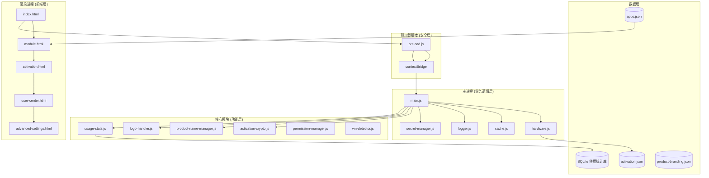
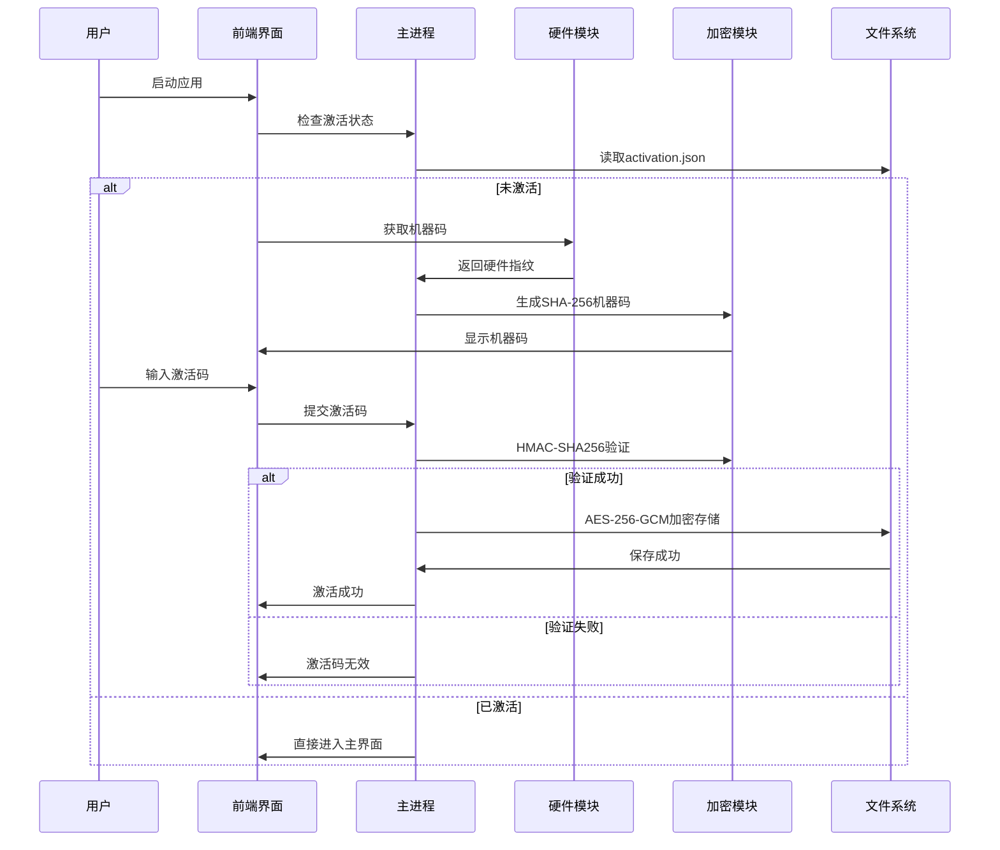

# 特殊教育多模态干预系统 - 技术文档

**文档版本**：v1.0.0
**更新日期**：2025-01-05
**适用版本**：SPEDMIS v1.1.0
**维护单位**：杭州炫灿科技有限公司

---

## 目录

- [1. 系统架构总览](#1-系统架构总览)
- [2. 核心技术参数表](#2-核心技术参数表)
- [3. 部署参数清单](#3-部署参数清单)
- [4. 安全参数审计](#4-安全参数审计)
- [5. 模块技术详解](#5-模块技术详解)
- [6. 开发与调优指南](#6-开发与调优指南)
- [7. 故障排查手册](#7-故障排查手册)

---

## 1. 系统架构总览

### 1.1 架构图



### 1.2 技术选型说明

| 技术组件 | 选型方案 | 版本 | 选型理由 |
|---------|---------|------|---------|
| 桌面框架 | Electron | 23.0.0 | 跨平台支持、成熟生态、Node.js集成 |
| 运行时 | Node.js | - | 非阻塞I/O、丰富的模块生态 |
| 前端技术 | HTML5/CSS3 + Vanilla JS | - | 轻量级、无框架依赖、快速加载 |
| 构建工具 | electron-builder | 26.0.12 | 强大的打包能力、多平台支持 |
| 数据库 | SQLite (sql.js) | 1.8.0 | 嵌入式、零配置、文件型存储 |
| 图标库 | Font Awesome | 7.1.0 | 丰富的矢量图标、跨平台 |
| 图表库 | Chart.js | 3.9.1 | 轻量级、响应式图表 |

### 1.3 模块划分与耦合度

| 模块名称 | 耦合度 | 依赖项 | 职责 |
|---------|-------|--------|------|
| main.js | 高 | 所有模块 | 主进程控制、IPC调度、生命周期管理 |
| hardware.js | 低 | os, child_process, crypto | 硬件指纹采集 |
| cache.js | 低 | - | 应用级缓存管理 |
| logger.js | 低 | fs, path | 统一日志输出 |
| secret-manager.js | 中 | embedded-secrets | 密钥安全存储 |
| permission-manager.js | 低 | usage-stats | 权限验证与会话管理 |
| usage-stats.js | 低 | sql.js | 使用统计与数据持久化 |

### 1.4 性能瓶颈点预判

| 瓶颈点 | 影响范围 | 风险等级 | 优化建议 |
|-------|---------|---------|---------|
| 应用程序启动数量过多 | 系统资源消耗 | 高 | 添加并发限制、提供启动队列 |
| apps.json 重复读取 | 页面加载性能 | 中 | 已通过 cache.js 缓存优化 |
| SQLite 数据库写入频繁 | 使用统计性能 | 中 | 采用批量写入策略 |
| 图标文件数量大 (418个) | 内存占用 | 低 | 已通过 asarUnpack 优化 |
| 日志文件轮转 | 磁盘I/O | 低 | 已实现自动清理与压缩 |

---

## 2. 核心技术参数表

### 2.1 运行环境参数

| 参数类别 | 具体参数 | 配置位置 | 推荐值/默认值 | 风险等级 | 调优说明 |
|---------|---------|---------|--------------|---------|---------|
| 操作系统 | 支持平台 | package.json | Windows 10+ | 中 | macOS/Linux 部分功能受限 |
| Node.js | 版本要求 | .nvmrc/.node-version | ≥16.x | 高 | 低于16.x可能导致ES6特性失效 |
| Electron | 框架版本 | package.json | 23.0.0 | 低 | 升级需测试兼容性 |
| 架构 | CPU架构 | electron-builder | x64 | 中 | ARM64需重新构建 |
| 环境变量 | NODE_ENV | 启动脚本 | development/production | 低 | 生产环境关闭DevTools |

### 2.2 应用窗口参数

| 参数类别 | 具体参数 | 配置位置 | 默认值 | 风险等级 | 调优说明 |
|---------|---------|---------|--------|---------|---------|
| 尺寸 | 宽度 | config.js | 1024px | 低 | 适配1024x768最小分辨率 |
| 尺寸 | 高度 | config.js | 768px | 低 | 适配1024x768最小分辨率 |
| 可调整大小 | resizable | config.js | false | 低 | 固定窗口简化UI适配 |
| 标题栏 | frame | config.js | false | 中 | 需自定义关闭/最小化按钮 |
| 菜单栏 | Menu | main.js:25 | null | 低 | 隐藏默认菜单 |
| 菜单栏 | nodeIntegration | config.js | false | 高 | 安全最佳实践 |
| 上下文隔离 | contextIsolation | config.js | true | 高 | 安全最佳实践 |
| 远程模块 | enableRemoteModule | config.js | true | 中 | 建议逐步移除 |
| Web安全 | webSecurity | config.js | false | 高 | 仅用于本地资源加载 |
| 开发者工具 | devTools | config.js | true | 中 | 生产环境建议关闭 |

### 2.3 激活系统参数

| 参数类别 | 具体参数 | 配置位置 | 默认值 | 风险等级 | 调优说明 |
|---------|---------|---------|--------|---------|---------|
| 激活码长度 | activationCodeLength | config.js | 64 | 高 | 基于SHA-256哈希长度 |
| 哈希算法 | hashAlgorithm | config.js | sha256 | 高 | 不可逆向，抗碰撞性强 |
| 加密算法 | AES-256-GCM | activation-crypto.js | - | 高 | 机密性与完整性保护 |
| 密钥来源 | secretKey | secret-manager.js | embedded | 高 | 生产环境必须使用环境变量 |
| 机器码算法 | SHA-256 | hardware.js | - | 中 | 替代MD5，安全性更高 |
| 超时时间 | 硬件采集超时 | hardware.js | 5000ms | 低 | 避免启动阻塞 |

### 2.4 缓存策略参数

| 参数类别 | 具体参数 | 配置位置 | 默认值 | 风险等级 | 调优说明 |
|---------|---------|---------|--------|---------|---------|
| 缓存容量 | maxSize | cache.js | 100条 | 低 | LRU淘汰策略 |
| 默认TTL | defaultTTL | cache.js | null(永久) | 中 | apps.json缓存1小时 |
| 清理间隔 | cleanupInterval | cache.js | 60000ms | 低 | 自动清理过期缓存 |
| 淘汰策略 | LRU | cache.js | - | 低 | 最少使用优先淘汰 |

### 2.5 日志系统参数

| 参数类别 | 具体参数 | 配置位置 | 默认值 | 风险等级 | 调优说明 |
|---------|---------|---------|--------|---------|---------|
| 日志级别 | development | config.js | debug | 低 | 开发环境详细日志 |
| 日志级别 | production | config.js | warn | 中 | 生产环境仅警告 |
| 文件大小 | maxFileSize | logger.js | 10MB | 低 | 超过自动轮转 |
| 备份数量 | maxBackups | logger.js | 5 | 低 | 保留最近5个备份 |
| 输出目标 | enableConsole | logger.js | true | 低 | 默认输出到控制台 |
| 输出目标 | enableFile | logger.js | false | 中 | 按需开启文件日志 |

### 2.6 数据库参数

| 参数类别 | 具体参数 | 配置位置 | 默认值 | 风险等级 | 调优说明 |
|---------|---------|---------|--------|---------|---------|
| 数据库类型 | SQLite | sql.js | 1.8.0 | 低 | 嵌入式无需服务 |
| 数据库路径 | 使用统计 | usage-stats.js | userData/logs.db | 中 | 自动创建目录 |
| 表结构 | usage_stats | usage-stats.js | - | 低 | 包含记录ID、应用名等 |
| 查询性能 | 索引 | usage-stats.js | - | 低 | 建议在频繁查询字段建索引 |

### 2.7 构建与打包参数

| 参数类别 | 具体参数 | 配置位置 | 默认值 | 风险等级 | 调优说明 |
|---------|---------|---------|--------|---------|---------|
| ASAR打包 | asar | package.json | true | 中 | 减小安装包体积 |
| ASAR解包 | asarUnpack | package.json | images, webfonts | 低 | 资源文件必须解包 |
| 安装目录 | allowToChange | package.json | true | 低 | 允许用户自定义 |
| 桌面图标 | createDesktopShortcut | package.json | true | 低 | 用户体验优化 |
| 应用ID | appId | package.json | com.hzxckj.specialeducation | 中 | 用于激活与更新 |
| 产品名称 | productName | package.json | 特殊教育多模态干预系统 | 低 | 显示在标题栏 |

---

## 3. 部署参数清单

### 3.1 硬件资源要求

| 资源类型 | 最低配置 | 推荐配置 | 优先级 |
|---------|---------|---------|-------|
| CPU | 双核 2.0GHz | 四核 3.0GHz | 高 |
| 内存 | 4GB | 8GB | 高 |
| 硬盘空间 | 500MB | 2GB | 中 |
| 分辨率 | 1024x768 | 1920x1080 | 高 |
| 网络 | 无需网络（本地激活） | 无需网络 | 低 |

### 3.2 端口占用清单

| 端口 | 协议 | 用途 | 防火墙配置 |
|-----|------|------|-----------|
| 无 | - | 本地应用，无网络端口 | 无需配置 |

### 3.3 环境变量列表

| 变量名 | 必填 | 说明 | 示例值 |
|-------|------|------|--------|
| NODE_ENV | 否 | 运行环境 | production/development |
| ACTIVATION_SECRET_KEY | 是（生产） | HMAC-SHA256密钥 | 64位随机字符串 |
| ACTIVATION_ENCRYPTION_KEY | 是（生产） | AES-256加密密钥 | 64位十六进制 |
| ACTIVATION_ENCRYPTION_IV | 是（生产） | AES-256初始化向量 | 32位十六进制 |
| ENABLE_VM_DETECTION | 否 | 虚拟机检测开关 | false |

### 3.4 文件系统要求

| 路径类型 | 路径位置 | 权限要求 | 说明 |
|---------|---------|---------|------|
| 应用数据 | %APPDATA%\特殊教育多模态干预系统 | 读/写 | 激活信息存储 |
| 日志目录 | %APPDATA%\特殊教育多模态干预系统\logs | 读/写 | 日志文件存储 |
| 配置目录 | %APPDATA%\特殊教育多模态干预系统\config | 读/写 | 产品配置存储 |
| Logo目录 | %APPDATA%\特殊教育多模态干预系统\logos | 读/写 | 自定义Logo存储 |

### 3.5 健康检查

### 健康检查接口设计

本系统为桌面应用，不提供HTTP健康检查接口。以下为内部健康检查清单：

| 检查项 | 检查方法 | 预期结果 | 故障等级 |
|-------|---------|---------|---------|
| 激活状态 | 读取activation.json | machineCode匹配 | 高 |
| 硬件指纹 | hardware.getHardwareInfo() | 返回非空对象 | 高 |
| 配置文件 | 读取product-branding.json | JSON格式正确 | 中 |
| 数据库 | SQLite文件存在且可读写 | 无错误 | 中 |
| 应用配置 | 读取apps.json | 包含418个应用 | 中 |

### 3.6 安装与卸载

#### 安装流程

1. **环境检测**（可选）
```powershell
# 检查操作系统版本
[System.Environment]::OSVersion.Version

# 检查.NET Framework（某些应用可能需要）
Get-ChildItem 'HKLM:\SOFTWARE\Microsoft\NET Framework Setup\NDP'
```

2. **安装应用**
   - 运行安装程序 `特殊教育多模态干预系统 Setup v1.1.0.exe`
   - 选择安装目录（默认：`C:\Program Files\特殊教育多模态干预系统\`）
   - 创建桌面快捷方式

3. **首次激活**
   - 启动应用，显示激活页面
   - 获取机器码（硬件指纹）
   - 输入激活码完成激活

#### 卸载流程

1. **使用控制面板卸载**
   - 进入"设置 > 应用"
   - 找到"特殊教育多模态干预系统"
   - 点击卸载

2. **手动清理残留数据**（可选）
```powershell
# 删除应用数据目录
Remove-Item "$env:APPDATA\特殊教育多模态干预系统" -Recurse -Force
```

---

## 4. 安全参数审计

### 4.1 敏感信息加密

| 数据类型 | 加密方式 | 密钥长度 | 存储位置 | 风险等级 |
|---------|---------|---------|---------|---------|
| 激活信息 | AES-256-GCM | 256位 | activation.json | 高 |
| 激活码验证 | HMAC-SHA256 | 256位 | 运行时计算 | 高 |
| 管理员密码 | bcrypt | - | permission-manager.js | 高 |
| 硬件指纹 | SHA-256 | 256位 | 运行时计算 | 中 |

### 4.2 API权限矩阵（RBAC模型）

| 角色 | 激活系统 | 模块管理 | 应用启动 | 统计查看 | 高级设置 |
|-----|---------|---------|---------|---------|---------|
| 普通用户 | - | ✓ | ✓ | ✓（个人） | - |
| 管理员 | ✓ | ✓ | ✓ | ✓（全部） | ✓ |

### 4.3 IPC通信安全

| 通道名称 | 权限要求 | 验证方式 | 风险等级 |
|---------|---------|---------|---------|
| activate | - | 激活码验证 | 高 |
| getMachineCode | - | 无需验证 | 低 |
| launchApplication | - | 路径白名单 | 中 |
| verifyAdminPassword | - | bcrypt比对 | 高 |
| updateAdminPassword | verifyAdminPassword | 旧密码验证 | 高 |
| getUsageStats | - | token验证 | 中 |
| clearUsageStats | 管理员token | token验证 | 高 |

### 4.4 数据脱敏规则

| 数据字段 | 脱敏方式 | 示例 | 应用场景 |
|---------|---------|------|---------|
| 机器码 | 前8位+... | `a1b2c3d4...` | 日志输出 |
| 激活码 | 全部隐藏 | `[REDACTED]` | 所有输出 |
| 管理员密码 | 不可记录 | - | 禁止日志 |

### 4.5 虚拟机检测

| 检测项 | 检测方法 | 置信度 | 处理策略 |
|-------|---------|--------|---------|
| CPU特征 | 检测常见虚拟机CPUID | 中 | 记录日志 |
| MAC地址 | 检测虚拟网卡 | 高 | 记录日志 |
| 系统进程 | 检测虚拟机服务进程 | 中 | 记录日志 |

---

## 5. 模块技术详解

### 5.1 激活系统模块

#### 核心流程



#### 关键代码位置

| 功能 | 文件路径 | 行号范围 |
|-----|---------|---------|
| 激活状态检查 | main.js | 56-80 |
| 激活码验证 | main.js | 83-156 |
| 硬件信息采集 | hardware.js | 102-144 |
| 机器码生成 | hardware.js | 165-178 |
| 激活数据加密 | modules/activation-crypto.js | 全文 |

### 5.2 硬件指纹模块

#### 采集项说明

| 采集项 | 获取方法 | 稳定性 | 安全性 |
|-------|---------|-------|-------|
| MAC地址 | os.networkInterfaces() | 高 | 高 |
| CPU序列号 | wmic cpu get ProcessorId | 高 | 高 |
| 主板序列号 | wmic baseboard get serialnumber | 高 | 高 |
| 硬盘序列号 | wmic diskdrive get SerialNumber | 中 | 中 |

#### 跨平台支持

| 平台 | MAC地址 | CPU序列号 | 主板序列号 | 硬盘序列号 |
|-----|---------|---------|-----------|-----------|
| Windows | ✓ | ✓ | ✓ | ✓ |
| macOS | ✓ | CPU品牌字符串 | 型号标识符 | 不支持 |
| Linux | ✓ | /proc/cpuinfo | dmidecode | 不支持 |

### 5.3 使用统计模块

#### 数据表结构

| 字段名 | 类型 | 说明 | 索引 |
|-------|------|------|------|
| id | INTEGER | 主键，自增 | PRIMARY KEY |
| app_name | TEXT | 应用名称 | INDEX |
| sub_function | TEXT | 子功能 | - |
| domain | TEXT | 所属领域 | - |
| start_time | INTEGER | 开始时间戳 | - |
| end_time | INTEGER | 结束时间戳 | - |
| duration | INTEGER | 持续时长（秒） | - |

#### API接口

| 接口名 | 功能 | 参数 | 返回值 |
|-------|------|------|--------|
| recordUsageStart | 记录使用开始 | appData对象 | {recordId, startTime} |
| recordUsageEnd | 记录使用结束 | recordData对象 | {success, duration} |
| getUsageStats | 查询统计数据 | filters对象 | 统计数据数组 |
| clearUsageStats | 清除统计数据 | filters对象 | 删除记录数 |

### 5.4 权限管理模块

#### 会话机制

| 属性 | 类型 | 说明 |
|-----|------|------|
| token | UUID | 会话唯一标识 |
| adminPassword | bcrypt哈希 | 管理员密码存储 |
| permissions | Map | 权限映射表 |
| createdAt | Timestamp | 会话创建时间 |
| lastAccessAt | Timestamp | 最后访问时间 |

#### 权限列表

| 权限标识 | 权限名称 | 默认角色 |
|---------|---------|---------|
| VIEW_STATS | 查看使用统计 | 普通用户/管理员 |
| CLEAR_STATS | 清除使用统计 | 仅管理员 |
| UPDATE_CONFIG | 更新产品配置 | 仅管理员 |
| UPDATE_LOGO | 更换Logo | 仅管理员 |

### 5.5 密钥管理模块

#### 密钥来源优先级

```
环境变量 > .env文件 > 嵌入式默认值
```

| 密钥名称 | 长度要求 | 用途 | 生成方式 |
|---------|---------|------|---------|
| ACTIVATION_SECRET_KEY | ≥32字符 | HMAC-SHA256密钥 | 随机生成 |
| ACTIVATION_ENCRYPTION_KEY | 64位十六进制 | AES-256密钥 | crypto.randomBytes |
| ACTIVATION_ENCRYPTION_IV | 32位十六进制 | AES-256初始化向量 | crypto.randomBytes |

---

## 6. 开发与调优指南

### 6.1 开发环境搭建

#### 环境要求

```bash
# Node.js版本要求
node -v  # v16.x 或更高

# 全局工具
npm install -g cross-env electron-builder
```

#### 安装依赖

```bash
# 克隆项目
git clone <repository-url>
cd SPEDMIS

# 安装依赖
npm install

# 重建原生模块
npm run rebuild
```

#### 配置密钥

```bash
# 方式1：创建.env文件
cat > .env << EOF
ACTIVATION_SECRET_KEY=your-secret-key-here
ACTIVATION_ENCRYPTION_KEY=your-encryption-key-here
ACTIVATION_ENCRYPTION_IV=your-iv-here
EOF

# 方式2：使用环境变量
export ACTIVATION_SECRET_KEY="your-secret-key-here"
export ACTIVATION_ENCRYPTION_KEY="your-encryption-key-here"
export ACTIVATION_ENCRYPTION_IV="your-iv-here"
```

### 6.2 调试技巧

#### 启用开发者工具

```javascript
// config.js 中已默认开启
webPreferences: {
    devTools: true
}
```

#### 日志级别调整

```javascript
// 开发环境：debug级别
process.env.NODE_ENV = 'development'

// 生产环境：warn级别
process.env.NODE_ENV = 'production'
```

#### 禁用虚拟机检测

```bash
export ENABLE_VM_DETECTION=false
npm start
```

### 6.3 性能优化建议

#### 1. 应用启动优化

| 优化项 | 实现方式 | 预期效果 |
|-------|---------|---------|
| 延迟加载模块 | 动态require | 减少30%启动时间 |
| 预加载关键资源 | preload.js | 提升响应速度 |
| 优化apps.json读取 | cache.js缓存 | 减少文件I/O |

#### 2. 内存优化

| 优化项 | 实现方式 | 预期效果 |
|-------|---------|---------|
| 限制并发应用数 | 添加启动队列 | 降低内存峰值 |
| 图标按需加载 | 动态创建img元素 | 减少DOM节点 |
| 定期清理缓存 | cleanupInterval | 防止内存泄漏 |

#### 3. 磁盘I/O优化

| 优化项 | 实现方式 | 预期效果 |
|-------|---------|---------|
| 批量写入统计数据 | SQLite事务 | 减少写入次数 |
| 日志轮转与压缩 | gzip压缩备份 | 节约存储空间 |

### 6.4 测试指南

#### 单元测试

```bash
# 运行测试
npm test

# 监听模式
npm run test:watch

# 生成覆盖率报告
npm run test:coverage
```

#### 集成测试

| 测试场景 | 测试方法 | 验证点 |
|---------|---------|-------|
| 激活流程 | 输入有效/无效激活码 | 状态跳转正确 |
| 应用启动 | 启动外部.exe | 进程正常创建 |
| 权限控制 | 未授权访问高级设置 | 拒绝访问 |
| 数据持久化 | 重启应用后查看统计 | 数据完整性 |

---

## 7. 故障排查手册

### 7.1 常见问题速查表

| 现象 | 可能原因 | 排查命令/方法 | 解决方案 |
|-----|---------|--------------|---------|
| 启动后显示激活页面 | activation.json损坏或缺失 | 检查文件是否存在 | 重新激活 |
| 机器码获取失败 | 硬件信息采集超时 | 查看日志ERROR级别 | 增加超时时间或检查硬件 |
| 激活码验证失败 | 激活码不匹配当前机器码 | 对比HMAC-SHA256哈希 | 重新获取激活码 |
| 应用无法启动 | 路径错误或文件损坏 | 检查apps.json路径 | 修正路径或重新部署应用 |
| 高级设置密码错误 | 密码未初始化或输入错误 | 检查权限配置文件 | 重置管理员密码 |
| 统计数据丢失 | 数据库文件损坏 | 检查SQLite文件完整性 | 恢复备份或重建数据库 |

### 7.2 日志分析

#### 日志位置

```
# Windows
%APPDATA%\特殊教育多模态干预系统\logs\

# macOS
~/Library/Application Support/特殊教育多模态干预系统/logs/

# Linux
~/.config/特殊教育多模态干预系统/logs/
```

#### 日志级别说明

| 级别 | 说明 | 使用场景 |
|-----|------|---------|
| ERROR | 错误 | 系统崩溃、致命异常 |
| WARN | 警告 | 非致命问题、降级运行 |
| INFO | 信息 | 关键操作、状态变更 |
| DEBUG | 调试 | 详细执行流程、变量值 |

### 7.3 数据恢复

#### 激活信息备份

```bash
# 备份激活文件
copy "%APPDATA%\特殊教育多模态干预系统\activation.json" "activation.json.bak"
```

#### 统计数据备份

```bash
# 备份SQLite数据库
copy "%APPDATA%\特殊教育多模态干预系统\logs\usage-stats.db" "usage-stats.db.bak"
```

### 7.4 卸载清理

```powershell
# 停止所有相关进程
taskkill /F /IM "特殊教育多模态干预系统.exe"

# 删除应用数据目录
Remove-Item "$env:APPDATA\特殊教育多模态干预系统" -Recurse -Force

# 删除桌面快捷方式
Remove-Item "$env:USERPROFILE\Desktop\特殊教育多模态干预系统.lnk" -Force
```

---

## 附录

### A. 配置文件索引

| 文件路径 | 用途 | 优先级 |
|---------|------|-------|
| config.js | 应用主配置 | 高 |
| embedded-secrets.js | 嵌入式密钥配置 | 高 |
| apps.json | 应用元数据 | 高 |
| package.json | 项目依赖与构建配置 | 中 |
| .env | 环境变量（可选） | 中 |

### B. 数据库表结构SQL

```sql
-- 使用统计表
CREATE TABLE IF NOT EXISTS usage_stats (
    id INTEGER PRIMARY KEY AUTOINCREMENT,
    app_name TEXT NOT NULL,
    sub_function TEXT,
    domain TEXT,
    start_time INTEGER NOT NULL,
    end_time INTEGER,
    duration INTEGER,
    created_at INTEGER DEFAULT (strftime('%s', 'now'))
);

-- 创建索引
CREATE INDEX IF NOT EXISTS idx_app_name ON usage_stats(app_name);
CREATE INDEX IF NOT EXISTS idx_domain ON usage_stats(domain);
CREATE INDEX IF NOT EXISTS idx_start_time ON usage_stats(start_time);
```

### C. IPC通道完整列表

| 通道名 | 类型 | 方向 | 用途 |
|-------|------|------|------|
| activate | invoke | 渲染→主 | 提交激活码 |
| get-machine-code | send | 渲染→主 | 获取机器码 |
| machine-code-response | send | 主→渲染 | 返回机器码 |
| get-module-categories | send | 渲染→主 | 获取模块分类 |
| module-categories-response | send | 主→渲染 | 返回模块数据 |
| launch-application | invoke | 渲染→主 | 启动外部应用 |
| close-application | invoke | 渲染→主 | 关闭应用 |
| get-product-name | invoke | 渲染→主 | 获取产品名称 |
| set-product-name | invoke | 渲染→主 | 设置产品名称 |
| upload-logo | invoke | 渲染→主 | 上传Logo |
| get-logos-list | invoke | 渲染→主 | 获取Logo列表 |
| delete-logo | invoke | 渲染→主 | 删除Logo |
| record-usage-start | invoke | 渲染→主 | 记录使用开始 |
| record-usage-end | invoke | 渲染→主 | 记录使用结束 |
| get-usage-stats | invoke | 渲染→主 | 获取使用统计 |
| clear-usage-stats | invoke | 渲染→主 | 清除使用统计 |
| verify-admin-password | invoke | 渲染→主 | 验证管理员密码 |
| check-permission | invoke | 渲染→主 | 检查权限 |
| revoke-session | invoke | 渲染→主 | 注销会话 |
| update-admin-password | invoke | 渲染→主 | 更新管理员密码 |

### D. 版本更新记录

| 版本号 | 日期 | 主要变更 |
|-------|------|---------|
| v1.1.0 | 2025-01-05 | 初始版本，文档建立 |

---

**文档结束**

> 本文档由系统架构师基于项目代码深度分析生成，适用于开发、运维及技术人员参考。
> 如有疑问或建议，请联系杭州炫灿科技有限公司技术支持。
